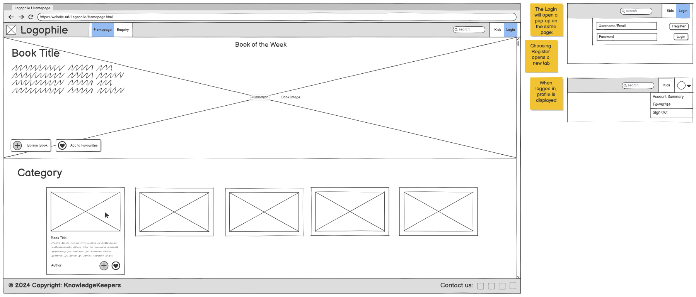
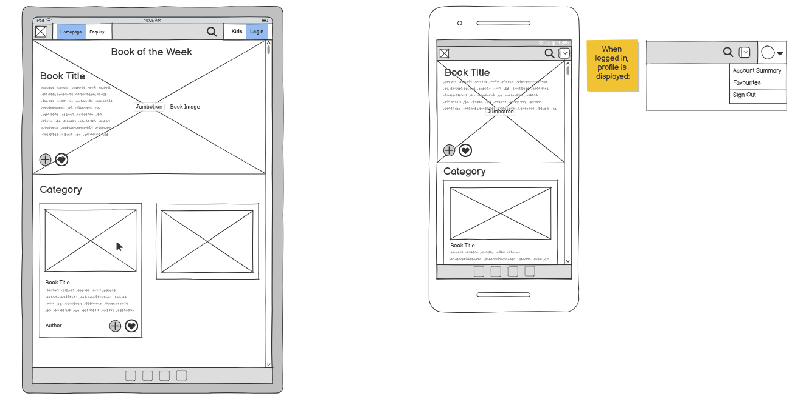
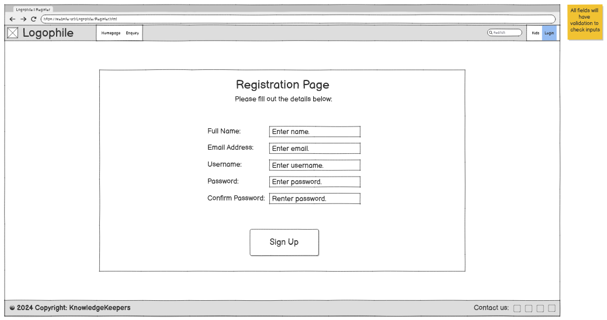
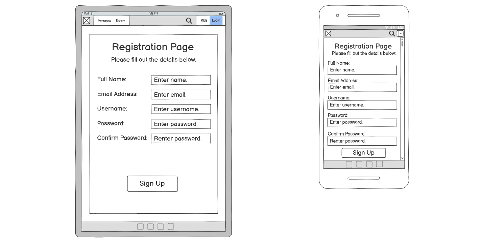
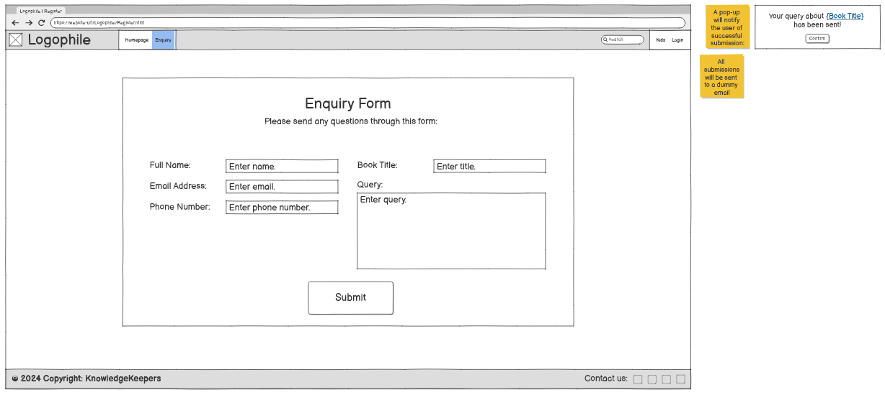
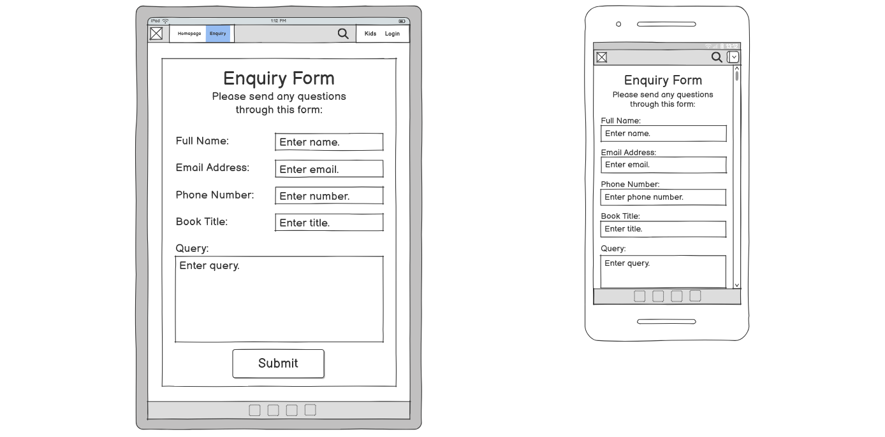
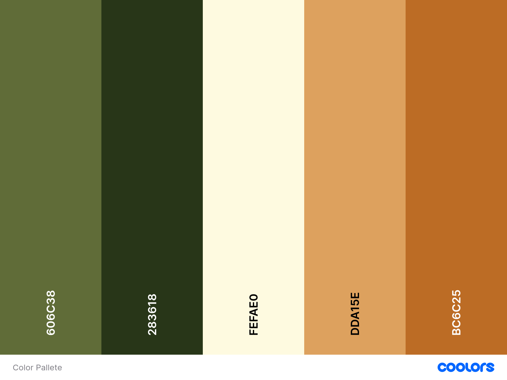

# E-Library

| <a href="https://prajaktasarnaik.github.io/E-Library-Repository/" target="_blank">Live Project</a> |

## Introduction
E-Library is a assessed portfolio project developed as part of the Code Institute Full Stack Software Developer Bootcamp, with the intention of demonstrating proficiency in HTML5, CSS and JavaScript to create a responsive website.

The intention of this project was to create an interactive website for an online library which will allow users to create an account and borrow books. The books displayed are sorted by genre, with each genre containing an initial five books to choose from.

The users can register an account and login to borrow and favourite books to view later in their account. Books available in the catalogue can be searched for by title, genre or author. Any enquiries about specific books can be sent to the library email via a form on the website.

## Contents
- [Introduction](#introduction)
- [UX](#user-experience)
  - [User Stories](#user-stories)
  - [Wireframes](#wireframes)
- [Design](#design)
  - [Topography](#topography)
  - [Colour Scheme](#colour-scheme)
- [Features](#features)
- [Testing](#testing)
  - [Manual Testing](#manual-testing)
  - [Known Bugs](#bugs)
- [Future Features](#future-features)
- [Technology Used](#tech-used)
- [Deployment](#deployment)
- [Credits](#credits)

## UX (User Experience)

### User Stories
- As a user, I want to register an account, so that I can borrow books and access personalized features.
- As a user, I want to search for books by title, author, or genre, so that I can easily find books of interest.
- As a user, I want to enquire about a specific book, so that I can get detailed information or request assistance regarding its availability.
- As a user, I want to view my borrowed books and favourited books, so that I can manage my reading schedule.

### Wireframes
Wireframes for all pages of the website were created before coding began. Versions for desktop, tablet and mobile size were created to reflect the responsive design expected. 

For the most part, the designs remained consistent with the implementation, but some changes were made - they will be shown and explained below.

- Homepage
  - The homepage has stayed mostly the same as the wireframe.
  - the login/registration dropdown was changed to a modal pop-up as it was decided that would be more suitable for user experience.

- Registration Page
  - The registration was initially intended to be a separate page, but was later changed to a pop-up which could be accessed from the navbar to be more consistent with the login display.

- Enquiry Page
  - The layout was changed to better ensure responsivity across different device sizes.
  - The success message pop-up was changed to a redirected success page with a return link (this was required in order to allow Web3Forms to send the user data inputs to the dummy email)
  - Added a Reset button for easily resetting the form
  

## Design

### Typography

The project used two sans-serif fonts which were implemented via [Google Fonts](https://fonts.google.com).

- [Grenze Gotisch](https://fonts.google.com/specimen/Grenze+Gotisch) was used as the main logo and heading font to make it stand out and fit with the theme of the website.
- [Open Sans](https://fonts.google.com/specimen/Open+Sans) was used for all the links and main content of the website to ensure easy readability.

### Colour Scheme

The colours used were taken from [Coolors](https://coolors.co/). Contrasting colours were used for the background, text and other elements (like buttons and info cards) to make the website easier to read and interact with. Some colours were not used in the final implementation, as they did not contrast enough to provide a suitable user experience.

- `#606C38` used for: read aloud buttons
- `#283618` used for: header & footer backgrounds, form & modal pop-up backgrounds, homepage headings & text, special buttons
- `#FEFAE0` used for: form & modal pop-up text, button text, selected buttons
- `#BC6C25` used for: buttons, selected button text, footer text & icon colour

## Website Features

The website consists of three pages with distinct sections to ensure a good user experience. All features on the website were implemented using a combination of HTML5, CSS (including Bootstrap) and JavaScript and are responsive on multiple device sizes in accordance with appropriate breakpoints. 

- Header Navigation Bar
  - A sticky navigation bar on all pages with the logo and website title which redirects to the homepage
  - Links to other pages on the website

- Login Pop-Up
  - A pop-up which allows users to log in to their account and validates their inputs to ensure the details entered are for a registered account
  - Contains a direct link to register a new account

- Registration Pop-Up
  - A pop-up which allows users to register a new account and validates their inputs to ensure the details entered are the correct format

- Dropdown Menu when Logged In
  - Displays up to 5 borrowed and favourite books and an option to log out
  - Page automatically refreshes after logging out

- Search Bar
  - Allows books to be searched by Title, Author or Genre
  - The first matching result is highlighted on the page

- Hero Section
  - Book of the Week with Title, Author, a short description and borrow & favourite buttons
- Borrow & Favourite Buttons
  - Buttons to add the chosen book to your account

- Catalogued Books
  - Books displayed with cover pages and sorted by genre
  - The title, short description and borrow & favourite buttons are displayed when a book is hovered over

- Enquiry Form Page
  - A separate page for users to send a enquiry to the library about specific books
  - Enquiries can be sent by both registered and unregistered users
  - The form validates user inputs and ensures all fields are filled

- Form Sends Email after Submit
  - The form will be sent to the library's email with the details entered by the user
  - The page will display a success page after submission
  - The form automatically clears after returning from success page

- Footer
  - Copyright details
  - Links to GitHub repository and social media sites

## Testing
Validation of HTML/CSS/JavaScript, Lighthouse Audits, Bugs

### Google Lighthouse Testing

High scores (90+) were achieved for both Desktop and Mobile when passing through the official [Google Lighthouse](https://pagespeed.web.dev/)

- Desktop

- Mobile

### Validator Testing 

- HTML
  - No errors were returned when passing through the official [W3C validator](https://validator.w3.org/nu/)

- CSS
  - No errors were found when passing through the official [(Jigsaw) validator](https://jigsaw.w3.org/css-validator/)

- JavaScript
  - No errors were found when passing through the official [JSHint validator](https://jshint.com/)

### Manual Testing
| Function | Expected Outcome | Does it work? |
| ----------- | ----------- | ----------- |
| General - Header | The header is displayed at the top of the page and sticks there. | Yes |
| General - Logo Link | The logo and title direct the user to the homepage when clicked. | Yes |
| General - NavBar | The NavBar links direct the user to the relevant pages when clicked. | Yes |
| General - NavBar Login | The Login link opens a pop-up when clicked. | Yes |
| General - Login | The Login pop-up allows the user to sign in or register. | Yes |
| General - Login Validation | The Login pop-up validates user's input if they sign in. | Yes |
| General - Login Registration Link | The Login pop-up redirects the user to the Registration page if the button is clicked. | Yes |
| General - Account Dropdown | When logged in, an account dropdown menu will appear with borrowed and favourited books listed. | Yes |
| General - Page Reset | The page reloads after logging out. | Yes |
| General - Footer | The footer is displayed at the bottom of the page and shows social media links and a copyright. | Yes |
| General - Footer Links | The social media links direct the user to the relevant websites when clicked. | Yes |
| General - Footer Links New Page | The social media links open in new pages. | Yes |
| General - Responsivity | The website is responsive and changes format depending on the device size. | Yes |
| Homepage - Hero Section | The Jumbrotron is displayed with a background image, text overlay and Borrow and Favourite buttons. | Yes |
| Homepage - Hero Section Buttons | The Borrow and Favourite buttons work as intended when clicked. | Yes |
| Homepage - Info Cards | The cards are displayed side by side with book titles and images. | Yes |
| Homepage - Info Cards Hover | The cards are expanded to show a short description and Borrow and Favourite buttons when hovered over. | Yes |
| Registration - Display Fields | The relevant fields are all visible and can be interacted with. | Yes |
| Registration - Input Validation | The text boxes validates the user's input to ensure data is in the correct format. | Yes |
| Registration - Submit Pop-Up | The button displays a pop-up when clicked to inform the user their details have been submitted. | Yes |
| Enquiry - Display Fields | The relevant fields are all visible and can be interacted with. | Yes |
| Enquiry - Input Validation | The text boxes validates the user's input to ensure data is in the correct format. | Yes |
| Enquiry - Submit Success | The page will show a success message to inform the user the query has been sent. | Yes |
| Enquiry - Submit Email | The query is be sent to a dummy email after it is submitted. | Yes |
| Enquiry - Form Reset | The form resets after returning from the submit page. | Yes |

### Known Bugs
- x

## Future Features
- Login section can take live user feed using jason-server.
  - Tried to achieve this functionality but it needed different setup on server side, so it was cut out.
- Accounts retain information about borrowed and favourite books.
- Rate and review books, so feedback can be shared with other users.
- View due dates for borrowed books.
- Receive notifications about book return dates, so they can be returned on time and avoid late fees.
- Borrowing e-books which can be read online or downloaded.
- Bookmark specific pages of e-books, to resume reading later.
- Personalized book recommendations for users based on previous enjoyed and well rated books.

## Technologies Used

### Technologies & Languages

- HTML5
- CSS
- JavaScript
- Git Version Control
- GitHub
- GitPod

### Libraries & Frameworks

- Bootstrap
- Google Fonts
- Font Awesome

### Tools & Programs

- Balsamiq
- Web3Forms
- Microsoft Copilot

## Deployment
This section should describe the process you went through to deploy the project to a hosting platform (e.g. GitHub) 

- The site was deployed to GitHub pages. The steps to deploy are as follows: 
  - In the GitHub repository, navigate to the Settings tab 
  - From the source section drop-down menu, select the Master Branch
  - Once the master branch has been selected, the page will be automatically refreshed with a detailed ribbon display to indicate the successful deployment. 

The live link can be found here - [E-Library, https://prajaktasarnaik.github.io/E-Library-Repository/](https://prajaktasarnaik.github.io/E-Library-Repository/)

## Credits

### Code

The project brief and primary learning and README.md template was supplied by [Code Institute](https://codeinstitute.net/).

Supplementary learning resources which were referenced throughout the project are listed below:

- [Bootstrap](https://getbootstrap.com/docs/5.3/getting-started/introduction/)
- [Web3Forms](https://docs.web3forms.com/)
- [Microsoft Copilot](https://copilot.microsoft.com/)

### Content 

- The text and content included in the website was generated using Microsoft Copilot AI
- The icons in the footer were taken from [Font Awesome](https://fontawesome.com/)
- The fonts were taken from [Google Fonts](https://fonts.google.com/)
- The colours were taken from [Coolors](https://coolors.co/)

### Media

- The images used for the Homepage page are genereated using Microsoft Copilot AI
- The images used for the Kids page are genereated using Microsoft Copilot AI
