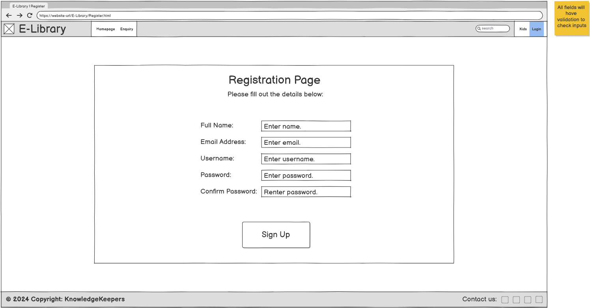

# Logophile

| <a href="https://prajaktasarnaik.github.io/Logophile-Repository/" target="_blank">Live Project</a> |

## Introduction
Logophile is a assessed portfolio project developed as part of the Code Institute Full Stack Software Developer Bootcamp, with the intention of demonstrating proficiency in HTML5, CSS and JavaScript to create a responsive website.

## Contents
The intention of this project was to create an interactive website for an online library which will allow users to create an account and borrow books. The books displayed are sorted by genre, with each genre containing an initial five books to choose from.

## UX (User Experience)

### User Stories
- As a user, I want to register an account, so that I can borrow books and access personalized features.
- As a user, I want to search for books by title, author, or genre, so that I can easily find books of interest.
- As a user, I want to enquire about a specific book, so that I can get detailed information or request assistance regarding its availability.
- As a user, I want to rate and review books, so that I can share my feedback with others.
- As a user, I want to view my borrowed books and their due dates, so that I can manage my reading schedule.
- As a user, I want to receive notifications about my book return dates, so that I can return my books on time and avoid late fees.
- As a user, I want to borrow an e-book, so that I can read it online or download it.
- As a user, I want to bookmark specific pages of e-books, so that I can resume reading later.
- As a user, I want to receive personalized book recommendations, so that I can discover books I’d enjoy.

### Wireframes
Wireframes for all pages of the website were created before coding began. Versions for desktop, tablet and mobile size were created to reflect the responsive design expected. 

For the most part, the designs remained consistent with the implementation, but some changes were made - they will be shown and explained below.

- Homepage
  - changes

- Registration Page
  - changes

- Enquiry Page
  - changes
  

## Design

### Typography

The project used two sans-serif fonts which were implemented via [Google Fonts](https://fonts.google.com).

- [Grenze Gotisch](https://fonts.google.com/specimen/Grenze+Gotisch) was used as the main logo and heading font to make it stand out and fit with the theme of the website.
- [Open Sans](https://fonts.google.com/specimen/Open+Sans) was used for all the links and main content of the website to ensure easy readability.

### Colour Scheme

The colours used were taken from [Coolors](https://coolors.co/). Contrasting colours were used for the background, text and other elements (like buttons and info cards) to make the website easier to read and interact with.

- `#606C38` used for: card background, 
- `#283618` used for: main background, textbox text
- `#FEFAE0` used for: main text, textbox background, button text
- `#DDA15E` used for: buttons
- `#BC6C25` used for: buttons selected

### Imagery

## Website Features
Include information on your JavaScript Logic/Functionality

The website consists of three pages with distinct sections to ensure a good user experience. All features on the website were implemented using a combination of HTML5, CSS (including Bootstrap) and JavaScript and are responsive on multiple device sizes in accordance with appropriate breakpoints. 

- x
- x

## Testing
Validation of HTML/CSS/JavaScript, Lighthouse Audits, Bugs

### Google Lighthouse Testing

High scores (90+) were achieved for both Desktop and Mobile when passing through the official [Google Lighthouse](https://pagespeed.web.dev/)

- Desktop

- Mobile

### Validator Testing 

- HTML
  - No errors were returned when passing through the official [W3C validator](https://validator.w3.org/nu/)

- CSS
  - No errors were found when passing through the official [(Jigsaw) validator](https://jigsaw.w3.org/css-validator/)

### Manual Testing
| Function | Expected Outcome | Does it work? |
| ----------- | ----------- | ----------- |
| General - Header | The header is displayed at the top of the page and sticks there. | Yes |
| General - Logo Link | The logo and title direct the user to the homepage when clicked. | Yes |
| General - NavBar | The NavBar links direct the user to the relevant pages when clicked. | Yes |
| General - NavBar Login | The Login link opens a pop-up when clicked. | Yes |
| General - Login | The Login pop-up allows the user to sign in or register. | Yes |
| General - Login Validation | The Login pop-up validates user's input if they sign in. | Yes |
| General - Login Registration Button | The Login pop-up redirects the user to the Registration page if the button is clicked. | Yes |
| General - Footer | The footer is displayed at the bottom of the page and shows social media links and a copyright. | Yes |
| General - Footer Links | The social media links direct the user to the relevant websites when clicked. | Yes |
| General - Footer Links New Page | The social media links open in new pages. | Yes |
| General - Responsivity | The website is responsive and changes format depending on the device size. | Yes |
| Homepage - Hero Section | The Jumbrotron is displayed with a background image, text overlay and Borrow and Favourite buttons. | Yes |
| Homepage - Book of the Week | The Jumbrotron displays the book of the week. | Yes |
| Homepage - Jumbotron Buttons | The Borrow and Favourite buttons work as intended when clicked. | Yes |
| Homepage - Info Cards | The cards are displayed side by side with book titles and images. | Yes |
| Homepage - Info Cards Hover | The cards are expanded to show a short description and Borrow and Favourite buttons when hovered over. | Yes |
| Registration - Display Fields | The relevant fields are all visible and can be interacted with. | Yes |
| Registration - Input Validation | The text boxes validates the user's input to ensure data is in the correct format. | Yes |
| Registration - Submit Pop-Up | The button displays a pop-up when clicked to inform the user their details have been submitted. | Yes |
| Enquiry - Display Fields | The relevant fields are all visible and can be interacted with. | Yes |
| Enquiry - Input Validation | The text boxes validates the user's input to ensure data is in the correct format. | Yes |
| Enquiry - Submit Pop-Up | The button displays a pop-up when clicked to inform the user the query has been sent. | Yes |
| Enquiry - Submit Email | The query is be sent to a dummy email after it is submitted. | Yes |

### Known Bugs
- x

## Future Features
- x

## Technologies Used

### Technologies & Languages

- HTML5
- CSS
- JavaScript
- Git Version Control
- GitHub
- GitPod

### Libraries & Frameworks

- Bootstrap
- Google Fonts
- Font Awesome

### Tools & Programs

- Balsamiq
- Microsoft Copilot

## Deployment
This section should describe the process you went through to deploy the project to a hosting platform (e.g. GitHub) 

- The site was deployed to GitHub pages. The steps to deploy are as follows: 
  - In the GitHub repository, navigate to the Settings tab 
  - From the source section drop-down menu, select the Master Branch
  - Once the master branch has been selected, the page will be automatically refreshed with a detailed ribbon display to indicate the successful deployment. 

The live link can be found here - [Logophile, https://prajaktasarnaik.github.io/Logophile-Repository/](https://prajaktasarnaik.github.io/Logophile-Repository/)

## Credits
Content References, Media References, Acknowledgements

### Code

The project brief and primary learning and README.md template was supplied by [Code Institute](https://codeinstitute.net/).

Supplementary learning resources which were referenced throughout the project are listed below:

- [Bootstrap](https://getbootstrap.com/docs/5.3/getting-started/introduction/)
- [Microsoft Copilot](https://copilot.microsoft.com/)

### Content 

- The text and content included in the website was generated using Microsoft Copilot
- The icons in the footer were taken from [Font Awesome](https://fontawesome.com/)
- The fonts were taken from [Google Fonts](https://fonts.google.com/)
- The colours were taken from [Coolors](https://coolors.co/)

### Media
- The images used for the hero section on the Homepage and Resources page are from: [Image URLs]()
